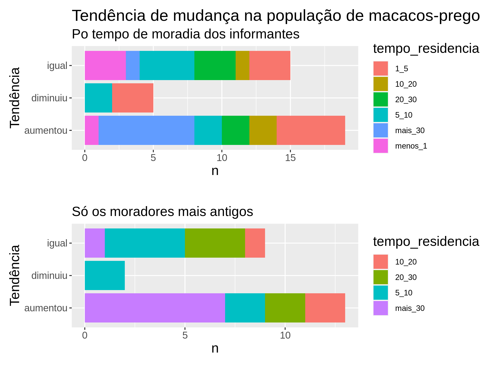

class: top, center

```{r setup, include=FALSE}
options(htmltools.dir.version = FALSE)
```

```{r webcam, echo=FALSE, include= TRUE}
xaringanExtra::use_webcam()
```

```{r xaringan_themes, echo = FALSE, include=FALSE}
	names(xaringan:::list_css())
```

```{r broadcast, echo=FALSE}
xaringanExtra::use_broadcast()
```
# SUMÁRIO

## 1. Contextualização;

## 2. Apresentação dos resultados da pesquisa.

---
# Distribuição geográfica do _Sapajus nigritus_

.pull-left[.center[]
_Fonte: Wikipedia_]

.pull-right[
#### Algumas curiosidades sociais
- Fêmeas e machos migram com a mesma probabilidade;
- Fêmeas não formam relações sociais fortes com outras fêmeas;
- Os machos formam relações sociais fracas, caracterizadas como tolerantes;
- Relações sociais mais fortes são entre fêmeas e machos;
- Parentesco não apresentou influencia nas interações.

_Fonte:_ [Tese de doutorado de Tokuda, 2012](https://www.teses.usp.br/teses/disponiveis/47/47132/tde-30042013-114148/publico/tokudacorrigida.pdf).
]


---
class: top, center

# Não subestime os macacos prego!

### Extremamente inteligentes

- Manipulam ferramentas para obtenção de larvas e polpa de coquinho de Jerivá

_Fonte:_ [Rocha et al. Revta  bras. Zool. 15 (4):  945 - 950, 1998](https://www.scielo.br/j/rbzool/a/YcqQNHqYcNvhcN6gJGXGp8j/?format=pdf&lang=pt)


---
class: top, center

### Extremamente inteligentes

#### Macacos-prego arrastam cursor sobre uma tela quando estimulados


_Fonte:_ [Tese de doutorado de Igor Dias Serique (2016)](https://ppgnc.propesp.ufpa.br/ARQUIVOS/dissertacoes/Disserta%C3%A7%C3%A3o%20Igor%20Serique%20v%20publicada.pdf)

---
### Eles cuidam de longe


--


--


--


---
class: top, center
## O que limita o crescimento populacional?

--

- Condições e recursos


_Imagem de [Khan Academy](https://pt.khanacademy.org)_
---
## Minha hipótese para o caso da Costa da Lagoa

.center[

]


---
class: top, left

### Estudos estimando população e densidade

- Densidade: entre **19** e **33** indivíduos/ Km²

- População estimada entre **45** e **75** indivíduos em um fragmento de 230 ha (Mata São José) em SP (Entre Rio Claro e Araras)

_Fonte:_ [Bernardo & Galetti. Revista Brasileira de Zoologia 21 (4): 827–832, 2004](https://www.scielo.br/j/rbzool/a/3dTt5RZzDrDkGNrsSrRW8Xr/?format=pdf&lang=pt)

.center[

_Fonte da imagem:_[Josi Cristina/VC no TG](https://g1.globo.com/sp/campinas-regiao/terra-da-gente/vc-no-terra-da-gente/noticia/2017/03/familia-de-macacos-prego-e-fotografada-no-mato-grosso-do-sul.html)
]


---
### Estratégias de forrageamento

- Generalistas: comem de tudo: pequenas aves, larvas, lagartos, insetos, frutos, sementes, flores, folhas, brotos de bromélia e de gramíneas; e **recursos antrópicos** 
.center[
]

_fonte:_ [Tese de Mota, 2019](https://repositorio.unb.br/handle/10482/35206)

---
class: top, center

# Violência contra macacos


---
class: top, center

# Casos preocupantes em SC

--


--


---
# Objetivos
.
### 1. Levantar os conhecimentos e percepções dos moradores; e
.

--

### 2. Mapear os conflitos existentes.

---
.center[
# Qual a importância desta pesquisa?
]

#### 1. Levantar e divugar dados abertamente;

--

#### 2. Proteger as populações de macacos-prego;

--

#### 3. Informar Gestores e tomadores de decisão;

--

#### 4. Guiar políticas de conservação e manejo;

--

#### 5. Incentivar e promover a ciência cidadã;

--

#### 6. Valorizar o conhecimento local; e

--

#### 7. Empoderar a comunidade.


---
class: top, left


# Métodos

- [Questionário](https://docs.google.com/forms/d/1uDRLT5u-qE48NJlz8nlVycuzkDSqP1HdGd_UTXbv6LM/edit) com 15 perguntas.

- Convites feitos através de grupos de WhatsApp da comunidade

- As figuras, análises e a apresentação foram feitas usando o [RStudio](https://rstudio.com)

- Código disponível no repositório do github [Mauritia-flexuosa](https://github.com/Mauritia-flexuosa/macaco-prego)

---
class: top, center


## Local `r emo::ji("island")` 

.left[Inclui área da [ReViS Meiembipe](https://www.pmf.sc.gov.br/arquivos/diario/pdf/11_11_2021_20.38.19.862cd1e58f3f3e523c6726b88c316e28.pdf)]


---
class: top, center

## Caracterizando os informantes  `r emo::ji("child")` `r emo::ji("adult")` `r emo::ji("older_adult")` `r emo::ji("zombie")`  

.left[
### 39 participantes
]


---
class: top, center

# Caracterizando os informantes


---
class: top, center

# Sobre comportamento dos macacos-prego


---
class: top, center

# 


---
class: top, center

# 


---
class: top, center

# 


---
class: top, center

# 


---
class: top, center

# 


---
class: top, center

# 


---
class: top, center

# 


---
class: top, center

# Alimentação


---
class: top, center

# Alimentação


---
class: top, center

# O que está ocorrendo com a população?


---
class: top, center

# 


---
class: top, center

# Estratégias usadas pelos moradores


---
class: top, center

# Estratégias usadas pelos moradores

.left[
<font size=6>"Fecho tudo quando me afasto de casa"</font><br>
<font size=6>"Amarrar a geladeira"</font><br>
<font size=6>"Alarme nas janelas"</font><br>
<font size=6>"Atenção aos sons dos galhos"</font><br>
<font size=6>"Cachorros em casa"</font><br>
<font size=6>"Não deixo frutas à vista"</font><br>
]


---
class: top, center
#  ...continuação

## Estratégias dos moradores

.left[

<font size=6>"Espanto com palmas e sons com a boca"</font><br>
<font size=6>"Converso com eles e mantenho as janelas fechadas quando ñ estóu em casa"</font><br>
<font size=6>"Gritar o nome do vizinho alto"</font><br>
<font size=6>"Funda com pedrinhas"</font><br>
]

---
class: top, left

# Recomendações

<font size=6>Não dê alimentos aos animais silvestres;</font><br>
<font size=6>Minimize os efeitos do seu pet no ambiente natural;</font><br>
<font size=6>Lembre-se que o que é bom para os humanos nem sempre faz bem aos animais;</font><br>
<font size=6>Busque informações em fontes seguras.</font><br>
<font size=6>Não seja violento, os animais não têm culpa!
---
class: center, top

# Quais os próximos passos?

.left[
<font size=5>1. Novos levantamentos;
<font size=5>2. Interesse de pesquisadores;
<font size=5>3. Ação de gestores e tomadores de decisão;
<font size=5>4. Participação ativa da comunidade.
]
.center[

_Imagem da Wikipedia_
]


---
class: top, center

## Obrigado aos nobres vizinhos que contribuiram com as informações.

### Comunidade unida é mais forte!


<footer><p class="small">

<h3>Contatos:</h3>

<div>
<a href = "mailto:marciobcure@gmail.com"></a>
 <a href="https://instagram.com/frutos_da_costa" target="_blank"></a>
</div>
</p></footer>


---
## Outras referências

- [Wikipedia - macaco-prego](https://pt.wikipedia.org/wiki/Macaco-prego-preto)
- [Notícia violência 1](https://g1.globo.com/sp/sao-jose-do-rio-preto-aracatuba/noticia/2022/08/10/policia-abre-inquerito-para-apurar-intoxicacao-e-morte-de-macacos-na-regiao-de-rio-preto.ghtml)
- [Notícia violência 2](https://crmvsp.gov.br/violencia-humana-mata-mais-macacos-que-febre-amarela-no-rio-de-janeiro/)
- [Algumas funções do macaco-prego](https://www.embrapa.br/busca-de-publicacoes/-/publicacao/1024368/o-papel-do-macaco-prego-sapajus-nigritus-na-dispersao-de-sementes-e-no-controle-potencial-de-insetos-praga-em-cultivos-agricolas-e-florestais)
- [Desidade e tamanho populacional](https://www.scielo.br/j/rbzool/a/3dTt5RZzDrDkGNrsSrRW8Xr/?format=pdf&lang=pt)
- Sobre comportamento social e forrageio de alimentos antrópicos: [Tese de Ricardo Mota](https://repositorio.unb.br/handle/10482/35206)

.center[

_Imagem da Wikipedia_
]